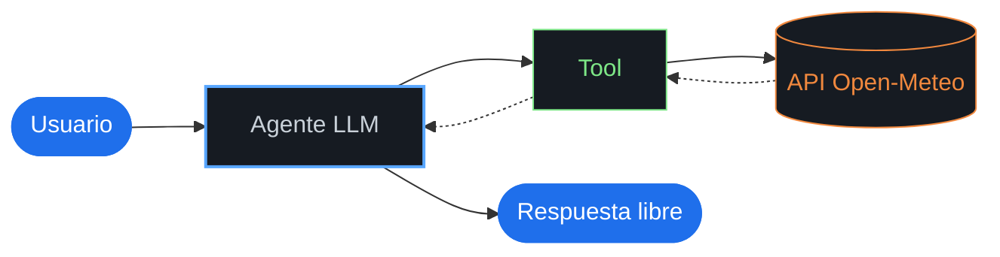
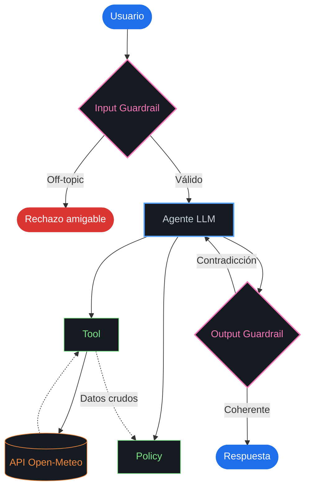
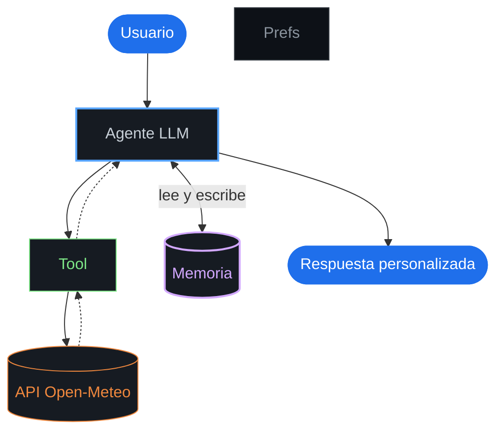
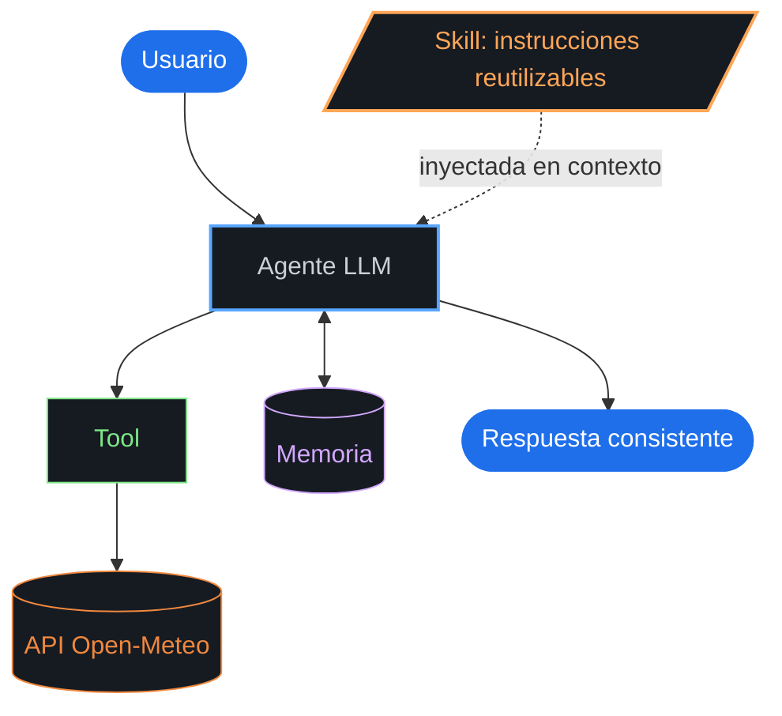
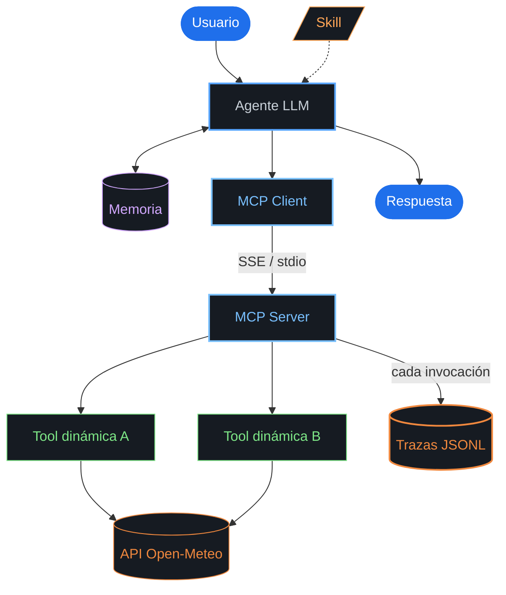
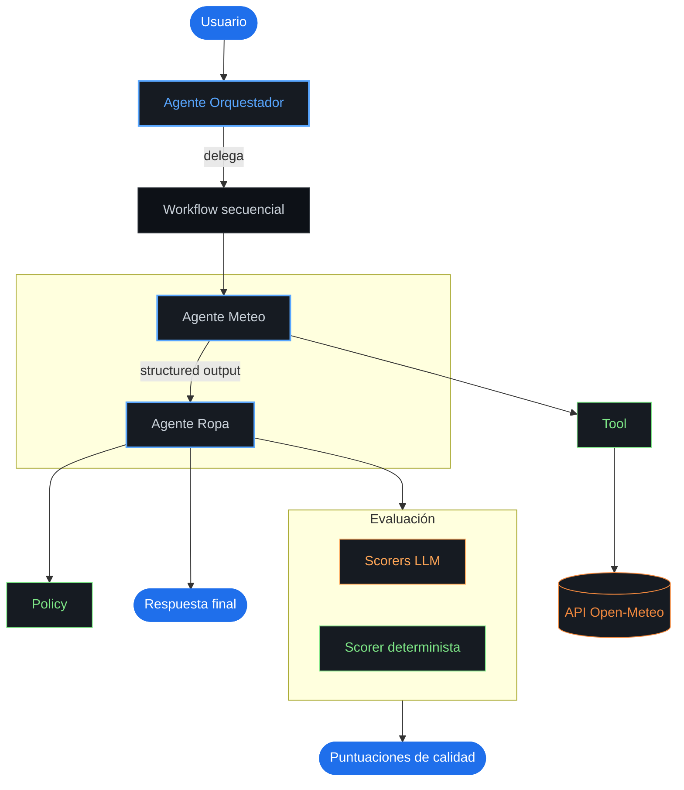
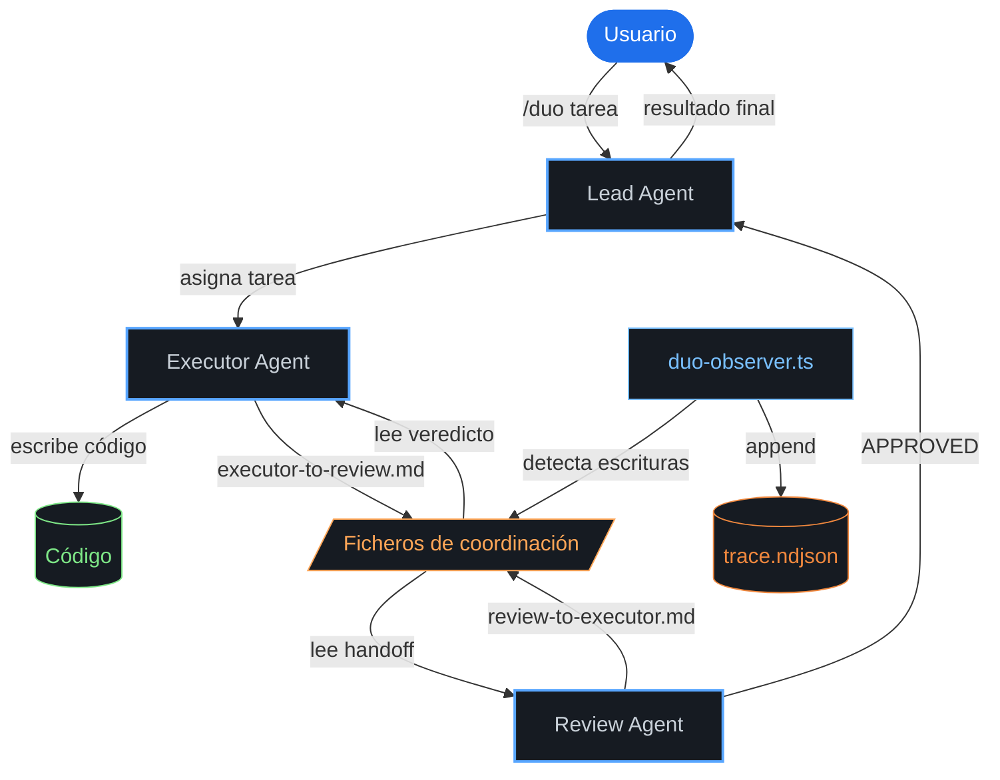
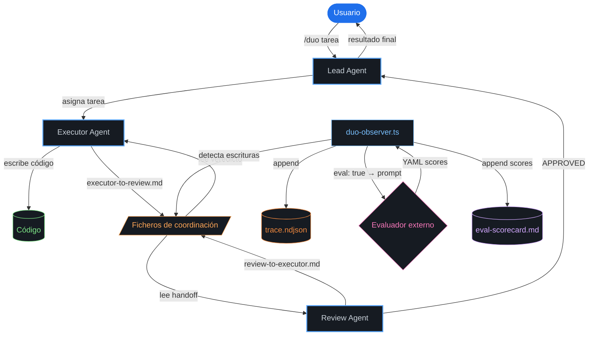
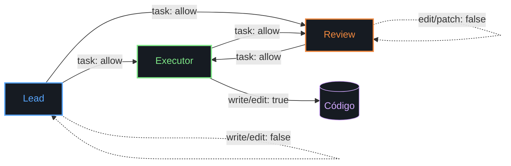

# Diagramas de Arquitectura

## Agente "¿hoy qué me pongo?"

### Nivel 1 — Augmented LLM

### Nivel 2 — Policy + Guardrails

### Nivel 3 — Working Memory

### Nivel 4 — Reusable Skill

### Nivel 5 — MCP + Observabilidad

### Nivel 6 — Multi-Agente + Evaluación

---

## OpenCode Duo Agent

### Arquitectura sin evaluador externo

### Arquitectura con evaluador externo

### Grafo de permisos entre agentes

