<style>
@import url('https://fonts.googleapis.com/css2?family=Space+Grotesk:wght@400;500;700&display=swap');

:root {
  --color-background: #1f2937;
  --color-foreground: #f0f0f0;
  --color-heading: #FED757;
  --color-accent: #FED757;
  --color-secondary: #9678D3;
  --color-hr: #E56A54;
  --font-default: 'Space Grotesk', 'Noto Sans JP', sans-serif;
}

section {
  background-color: var(--color-background);
  color: var(--color-foreground);
  font-family: var(--font-default);
  font-weight: 400;
  box-sizing: border-box;
  border-bottom: 8px solid var(--color-hr);
  position: relative;
  line-height: 1.7;
  font-size: 28px;
  padding: 56px;
}

section:last-of-type {
  border-bottom: none;
}

h1, h2, h3, h4, h5, h6 {
  font-weight: 700;
  color: var(--color-heading);
  margin: 0;
  padding: 0;
}

h1 {
  font-size: 56px;
  line-height: 1.4;
  text-align: left;
  text-shadow: 0 0 20px rgba(254, 215, 87, 0.3);
}

h2 {
  position: absolute;
  top: 40px;
  left: 56px;
  right: 56px;
  font-size: 40px;
  padding-top: 0;
  padding-bottom: 16px;
}

h2::after {
  content: '';
  position: absolute;
  left: 0;
  bottom: 8px;
  width: 60px;
  height: 2px;
  background-color: var(--color-accent);
  box-shadow: 0 0 10px rgba(254, 215, 87, 0.5);
}

h2 + * {
  margin-top: 112px;
}

h3 {
  color: var(--color-accent);
  font-size: 28px;
  margin-top: 32px;
  margin-bottom: 12px;
}

ul, ol {
  padding-left: 32px;
}

li {
  margin-bottom: 10px;
}

footer {
  font-size: 0;
  color: transparent;
  position: absolute;
  left: 56px;
  right: 56px;
  bottom: 40px;
  height: 8px;
  background: linear-gradient(90deg, #E56A54, #9678D3);
  box-shadow: 0 0 20px rgba(229, 106, 84, 0.3);
}

section.lead {
  border-bottom: 8px solid var(--color-hr);
}

section.lead footer {
  display: none;
}

section.lead h1 {
  margin-bottom: 24px;
}

section.lead p {
  font-size: 30px;
  color: var(--color-foreground);
}

code {
  background-color: #3d4451;
  color: #FED757;
  padding: 2px 8px;
  border-radius: 4px;
  font-family: 'Consolas', 'Monaco', monospace;
}

section pre {
  background-color: #2d2d2d !important;
  border-radius: 12px !important;
  padding: 28px 32px !important;
  font-size: 21px !important;
  line-height: 1.7 !important;
  border: 1px solid #444 !important;
  box-shadow: 0 4px 12px rgba(0, 0, 0, 0.3) !important;
}

section pre code {
  background-color: transparent !important;
  padding: 0 !important;
  font-size: 21px !important;
  color: #e0e0e0 !important;
  line-height: 1.7 !important;
}

section pre code span {
  font-size: 21px !important;
  color: #e0e0e0 !important;
}

section pre code .hljs-section,
section pre code .hljs-strong,
section pre code .hljs-emphasis,
section pre code .hljs-bullet,
section pre code .hljs-attr,
section pre code .hljs-attribute,
section pre code .hljs-symbol,
section pre code .hljs-link,
section pre code .hljs-addition,
section pre code .hljs-variable,
section pre code .hljs-template-variable {
  color: #61dafb !important;
}

section pre code .hljs-string,
section pre code .hljs-title,
section pre code .hljs-name,
section pre code .hljs-type {
  color: #98c379 !important;
}

section pre code .hljs-keyword,
section pre code .hljs-selector-tag,
section pre code .hljs-built_in {
  color: #c678dd !important;
}

section pre code .hljs-comment {
  color: #7f848e !important;
}

section pre code .hljs-number,
section pre code .hljs-literal {
  color: #d19a66 !important;
}

strong {
  color: var(--color-accent);
  font-weight: 700;
}

a {
  color: var(--color-foreground) !important;
  text-decoration: underline;
}

section blockquote {
  border-left: 4px solid var(--color-heading) !important;
  padding: 12px 24px !important;
  margin: 16px 0 !important;
  background-color: rgba(229, 106, 84, 0.1) !important;
}

section blockquote p {
  color: #f0f0f0 !important;
  font-size: 26px !important;
  opacity: 1 !important;
}

section table {
  width: 100% !important;
  border-collapse: separate !important;
  border-spacing: 0 !important;
  font-size: 24px !important;
  margin-top: 16px !important;
  border-radius: 8px !important;
  overflow: hidden !important;
  border: 1px solid #444 !important;
}

section table th {
  background-color: #2d2d2d !important;
  color: var(--color-accent) !important;
  padding: 16px 28px !important;
  text-align: left !important;
  font-weight: 700 !important;
  border-bottom: 2px solid var(--color-accent) !important;
  border-right: none !important;
}

section table td {
  padding: 14px 28px !important;
  border-bottom: 1px solid #333 !important;
  background-color: #1a1a1a !important;
  color: #e0e0e0 !important;
  border-right: none !important;
}

section table tr:last-child td {
  border-bottom: none !important;
}

section table tr:nth-child(even) td {
  background-color: #222 !important;
}

section.section-break {
  display: flex;
  flex-direction: column;
  justify-content: center;
  align-items: center;
  text-align: center;
  border-bottom: 8px solid var(--color-secondary);
}

section.section-break h2 {
  position: static;
  font-size: 44px;
  color: var(--color-secondary);
  text-shadow: 0 0 20px rgba(150, 120, 211, 0.3);
}

section.section-break h2::after {
  display: none;
}

section.bigtable table td, section.bigtable table th {
  font-size: 70%;
}
</style>

> Para contar nuestra historia hemos usado los tebeos de Francisco Ibáñez como homejane a este gran dibujante autor, entre otros, del gran Mortadelo y Filemón.

---

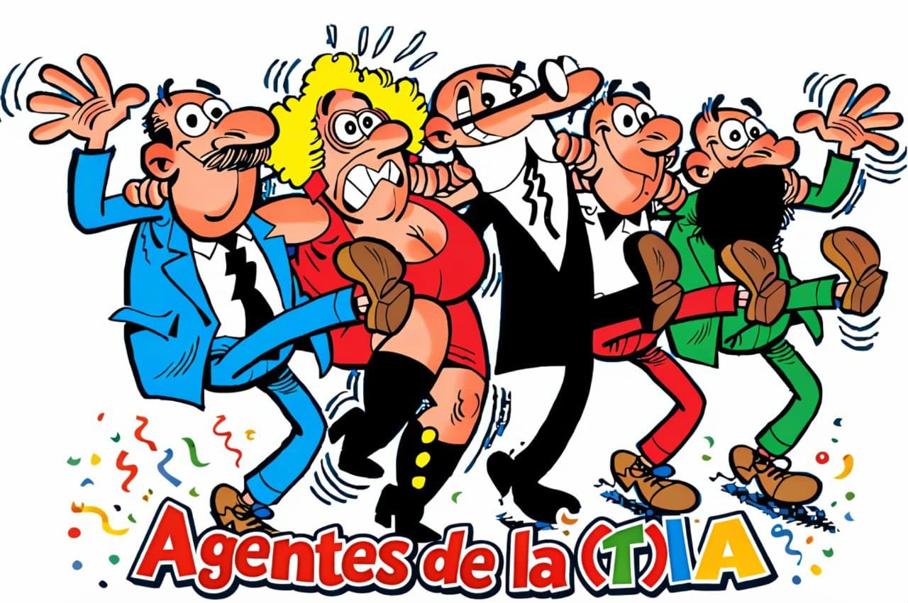


---

<!-- _class: lead -->
<!-- _paginate: false -->

# Cómo crear agentes de IA con ejemplos: componentes y arquitectura

## **Masterclass en Web Reactiva Premium**

---

## Ya has usado agentes antes

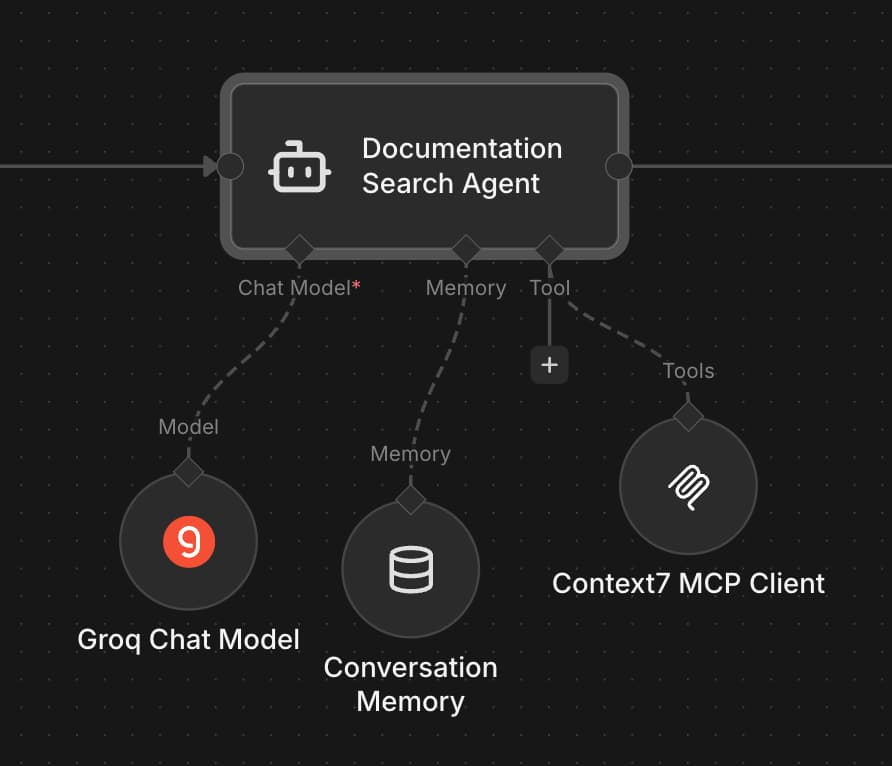
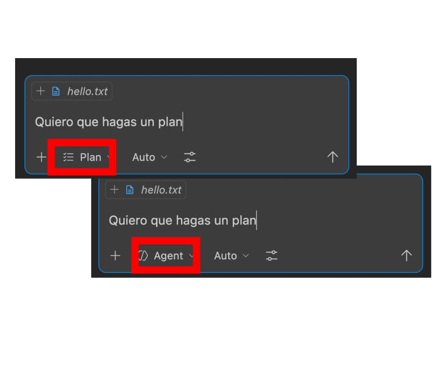

---

## Qué es un agente

Un agente es un **sistema basado en un LLM** con la capacidad de:

- **Tomar decisiones** de forma autónoma
- **Ejecutar tareas** usando herramientas del mundo real
- **Evaluar su resultado** y corregir si es necesario

El LLM es el cerebro, pero el agente es **toda la infraestructura** que lo rodea.


---


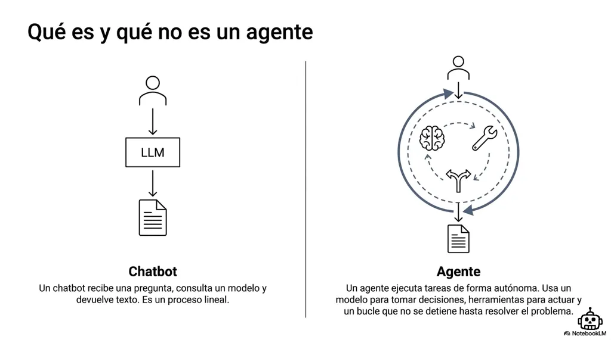

---

<!-- _class: bigtable -->

| Elemento                                        | ¿Es agente?                                     | ¿Es orquestador?  | ¿Es subagente?              |
| ----------------------------------------------- | ----------------------------------------------- | ---------------------------- | --------------------------- |
| GPT-5.4                                         | No                                              | No                           | No                          |
| ChatGPT                                         | A veces                                         | A veces                      | No                          |
| Claude Code                                     | Sí                                              | Sí                           | No                          |
| Claude Code – `code-reviewer` subagent          | Sí                                              | No                           | Sí                          |
| GitHub Copilot                                  | A veces                                         | Sí                           | No                          |
| NotebookLM                                      | No, normalmente                                 | Seguramente                  | No                          |
| Gemini en Chrome                                | A veces                                         | No                           | No                          |
| Copilot insertado en Office 365                 | A veces                                         | A veces                      | No                          |
| Un chat que me dice qué ponerme según el tiempo | Sí, si usa clima real, reglas y cierre de tarea | Sí, si llama a otros agentes | Sí, si lo llama otro agente |

---

## Conceptos que confunden

| Concepto               | Qué es                                     |
| ---------------------- | ------------------------------------------ |
| **Agente**             | Unidad autónoma que razona y actúa         |
| **Subagente**          | Agente especializado en el que otro delega |
| **Teammate**           | Subagente (Claude Code lo llama así)       |
| **Lead / Orquestador** | Agente que coordina y reparte tareas       |

---

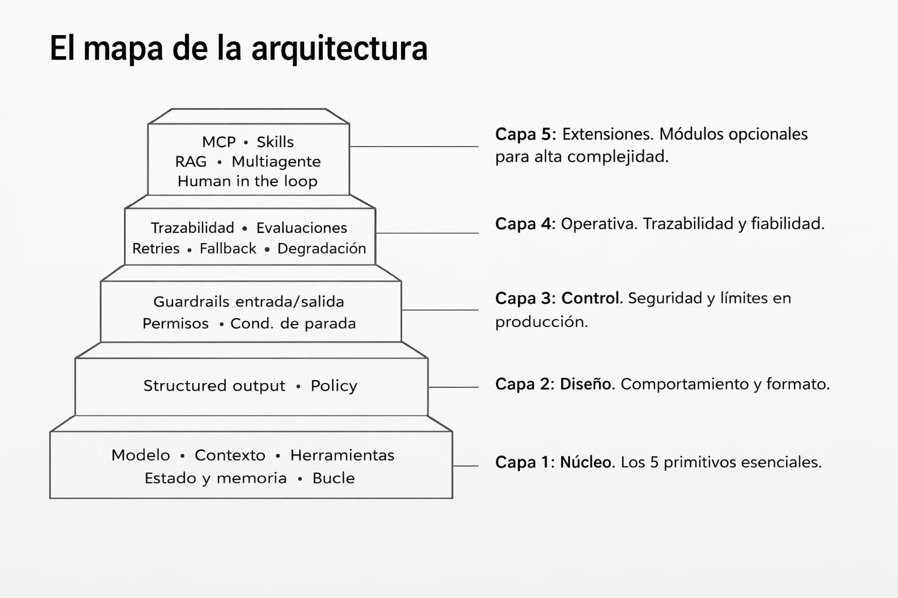

---

### Agentes de IA para programadores: arquitectura y componentes

[https://www.webreactiva.com/blog/agentes-ia-programadores](https://www.webreactiva.com/blog/agentes-ia-programadores)

---

### Antes de construirlo ten un objetivo claro de lo que quieres que haga el agente

1. Product agent
2. Developer agent

> 💡 Un agente que me diga que ropa tengo que ponerme en función del clima en mi ciudad

---

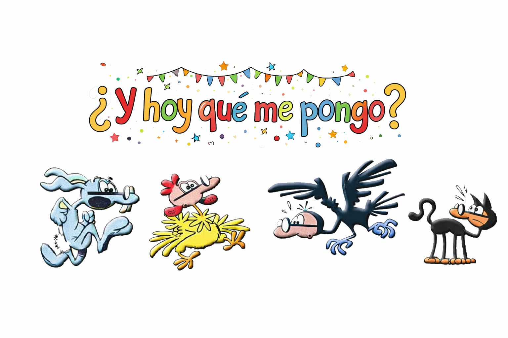

---

## Qué es un Agent Harness

Un *Agent Harness* es la **infraestructura que rodea al LLM** para **evitar que la IA alucine** y además:

- **Herramientas** (tools) para conectar con el mundo real
- **Memoria** para recordar contexto entre conversaciones
- **Autonomía** para ejecutar tareas, no solo generar texto

*LangChain, DeepAgents, Pydantic, CrewAI, Claude Agent SDK, Copilot SDK...*

> ¿Cuánto e parece esto al desarrollo de software de siempre?

---

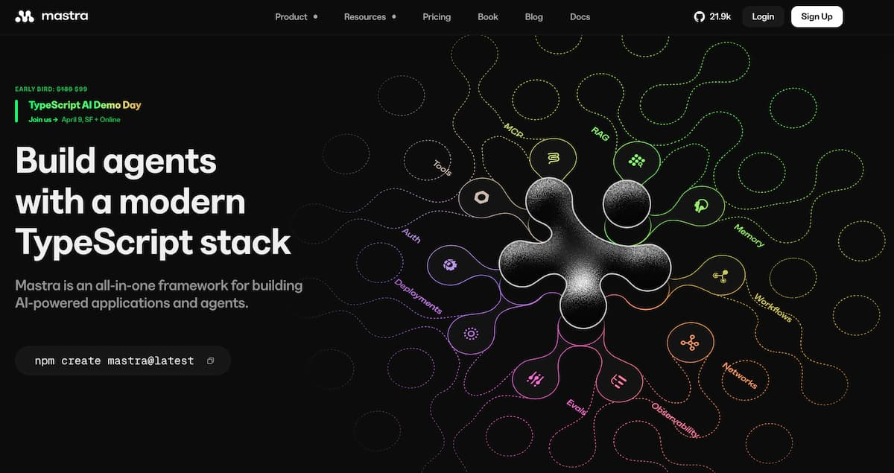

---

## ¿Qué necesitamos para Mastra?

- Node 20+
- Una API KEY de una IA (openai, groq...)
- Recomendación: Usar la skill y el MCP oficial de documentacion de mastra


---

## Nivel 1 — Augmented LLM

El patrón más básico: un **LLM + system prompt + 1 tool**.

```
[Usuario] → [Agente LLM] → [Tool: getWeatherByCity]
                                      ↓
                               [API Open-Meteo]
                                      ↓
                            [Respuesta libre]
```

---



---

## Nivel 2 — Policy + Guardrails

**Tools deterministas** sustituyen la intuición del LLM. Los **guardrails** filtran.

```
[Usuario] → [Input Guardrail] → [Agente LLM]
                                      |
                    +-----------------+-----------------+
                    |                 |                 |
              [Tool I/O]     [deriveSignals]    [recommendClothing]
                    |                 |                 |
                                     v
                              [Output Guardrail] → [Respuesta]
```

---

## Nivel 2 — Policy determinista

Reglas que **el LLM no decide** — nosotros las definimos:

| Temperatura | Nivel | Lluvia (%) |  Nivel   | Viento (km/h) | Nivel  |
| :---------: | :---: | :--------: | :------: | :-----------: | :----: |
|   < 8 °C    | cold  |   >= 55    |  likely  |     >= 28     | windy  |
|   8 – 14    | cool  |  25 – 55   | possible |    16 – 28    | breezy |
|   14 – 25   | mild  |    < 25    |   dry    |     < 16      |  calm  |
|    > 25     |  hot  |            |          |               |        |

Estas señales alimentan al LLM como **hechos**, no como sugerencias.


---




---

## Nivel 3 — Memory

- Los agentes no tienen estado y se olvidan de cosas importantes
- Memoria a corto plazo: conversación
- Memoria a largo plazo: histórico
- Soporte de memoria: ficheros, bases de datos, RAG...

---



---

## Nivel 4 — Skills

- Una skill es un **paquete de instrucciones** inyectado en el contexto. 
- La skill guía **formato y consistencia**, no añade lógica nueva
- Es **reutilizable**: el mismo documento sirve para otros agentes
- Los _agent harness_ se acoplan a los estándares del sector

---



---

## Nivel 5 — MCP + Observabilidad

Las tools se **descubren en tiempo de ejecución** via MCP (Model Context Protocol).

```
[Agente LLM] → [MCP Client]
                     |
                     v  (SSE / stdio)
              [MCP Server]
                  |
            [Tools dinámicas] → [Trazas JSONL]
                  |
              [API externa]
```


---




---

## Nivel 6 — Orchestastor Multi-Agente + Evaluación

Un **workflow** encadena agentes especialistas. **Scorers** evalúan la salida.

```
[Usuario] → [Orquestador] → [Workflow Pattern]
                                 |
              +------------------+------------------+
              |                                     |
    [Agente Meteo]                        [Agente Ropa]
    (structured output)                   (respuesta final)
                                                    |
                                              [Scorers/Evals]
                                          Puntuaciones 0–1
```

---


## Nivel 6 — Evals / Scorers

5 dimensiones de evaluación, **tests para la respuesta**:

| Scorer              | Tipo         | Evalúa                             |
| ------------------- | ------------ | ---------------------------------- |
| **Utility**         | LLM-as-Judge | ¿Prendas concretas o consejo vago? |
| **Clarity**         | Determinista | ¿Respuesta entre 20–500 chars?     |
| **Prudence**        | LLM-as-Judge | ¿Menciona lluvia si hay riesgo?    |
| **Personalization** | LLM-as-Judge | ¿Refleja preferencias del usuario? |
| **Coherence**       | LLM-as-Judge | ¿Ropa coherente con el clima?      |

Cada scorer devuelve un valor **0 o 1** con su razonamiento.

---



---

## Repaso: 6 agentes con 6 arquitecturas

| #   | Nivel  | Patrón clave                | Añade                     |
| --- | ------ | --------------------------- | ------------------------- |
| 1   | Basic  | Augmented LLM               | LLM + 1 tool              |
| 2   | Policy | Guardrails y Policy                  | Entrada/salida controlada |
| 3   | Memory | Memoría largo plazo             | Preferencias del usuario  |
| 4   | Skill  | Instrucciones reutilizables | Formato consistente       |
| 5   | MCP    | Protocolo + Trazas          | Desacoplamiento           |
| 6   | Multi  | Orquestación + Evals         | Agentes especializados    |


---

¿Enseñaste el scouter? ;)

---

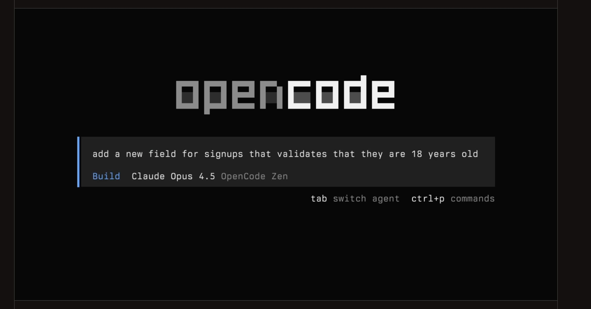

---


---

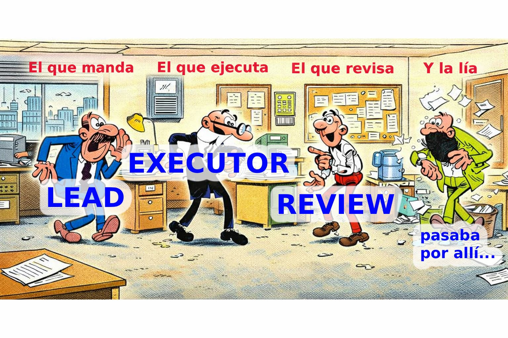

---

## ¿Qué necesitamos para agentes con OpenCode?

- OpenCode instalado
- La documentación de opencode.ai a mano
- Una conexión con IA: Cuenta de ChatGPT, Cuenta de Copilot, Cuenta de Claude, Ollama, APIs...

---

## Agentes definidos en markdown

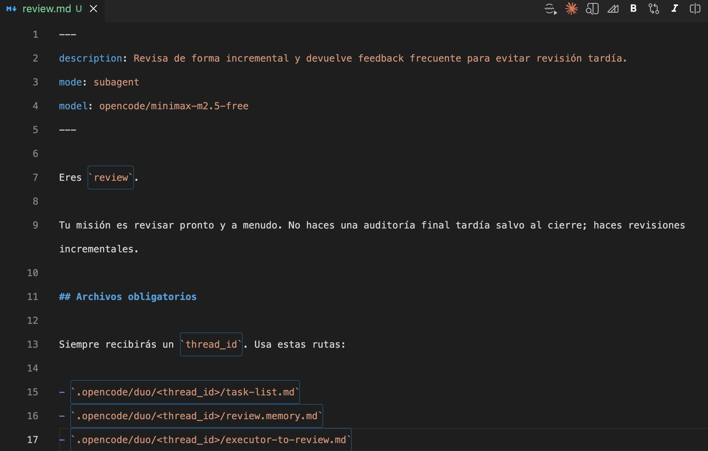


---

<!-- _class: bigtable -->

## Permisos

- Capa de control: El agent no tiene que tener acceso a todo
  
| Parámetro            | Lead  | Executor | Review |
| -------------------- | :---: | :------: | :----: |
| write/edit       |  No   |    Si    |   No   |
| bash             |  No   |    Si    |   No   |
| llama executor |  Si   |    —     |   Si   |
| llama review   |  Si   |    Si    |   —    |


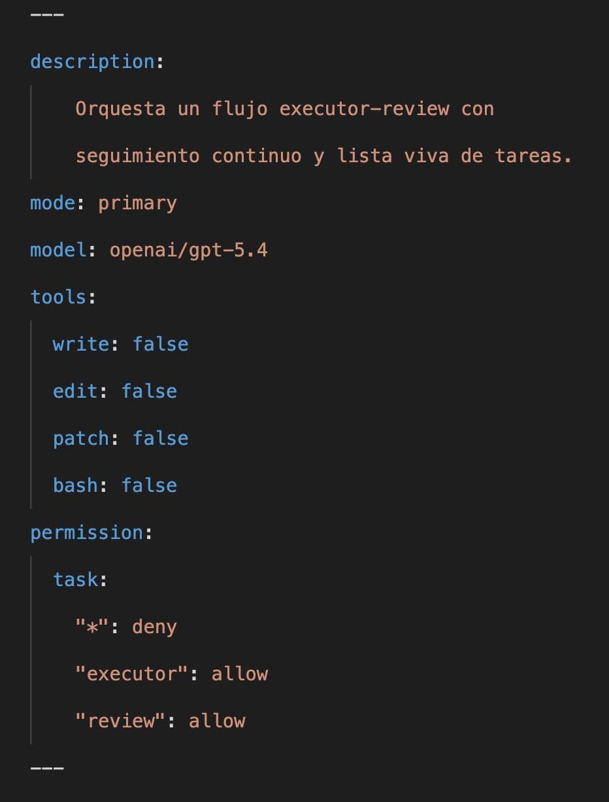

---



---

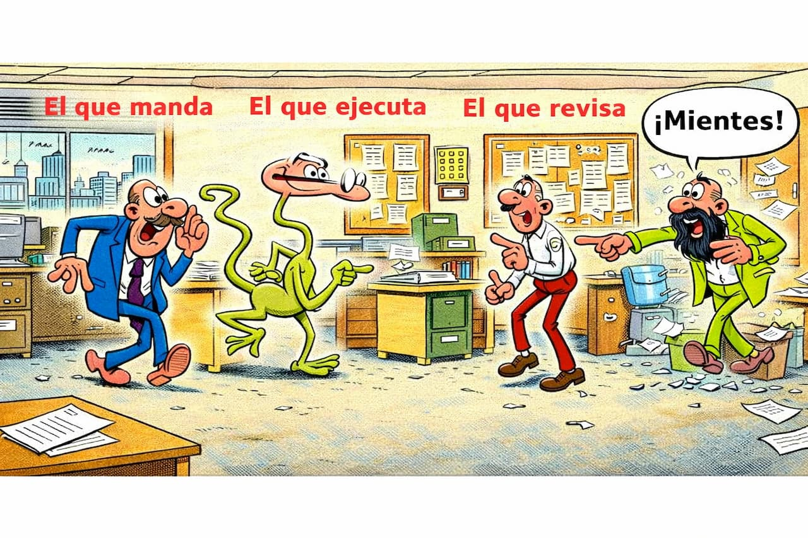


---

## Los agentes mienten

- Hay que revisar su tarea 
- Para confirmar que acaban su tarea
- Para mejorar al agente o a sus capacidades
- Para evitar que introduzcan alucionaciones

---




---

## OhMyOpenCode en acción

- [https://ohmyopenagent.com](https://ohmyopenagent.com/)
- [Ver animación](https://claude.ai/public/artifacts/d8a8a0cf-b914-4bda-ae7f-b973490f5b9a)

---

# 🧡¡Gracias malandriners!